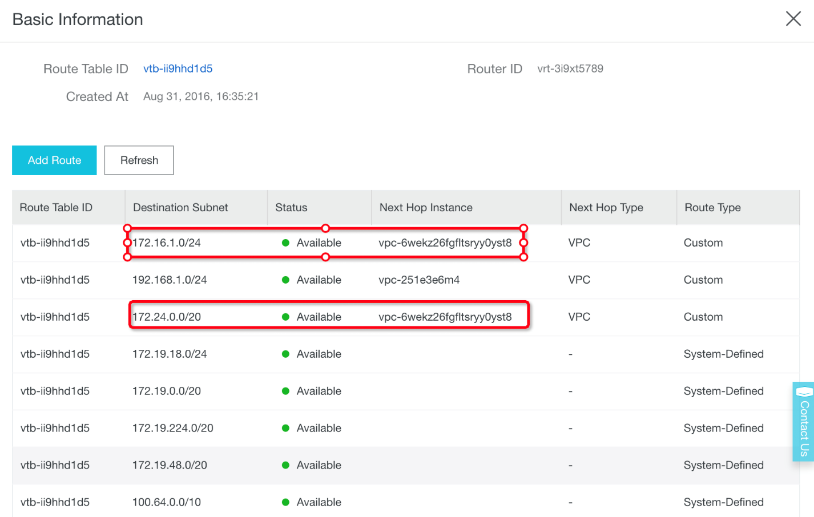

# **Migrate AWS S3 to Alibaba Cloud OSS via IPSec VPN and ExpressConnect**

Describe how to migrate data in AWS S3 bucket to Alibaba  Cloud OSS bucket via IPSec VPN tunnel and ExpressConnect

Dec. 2018

Abstract
========

When customers migrate data from AWS S3 to Alibaba Cloud OSS, especially cross
countries, there are usually two network architectures for them to choose from:

-   Transfer data based on the Internet

-   Data transmission based on private network

This document focuses on the second network architecture. The IPSEC VPN tunnel
and the Alibaba Cloud ExpressConnect product portfolio are combined to meet the
needs of the customer's internal network to transmit data and increase the
security of data transmission.

The overall network architecture is as follows：

The advantage of this network architecture is that the data in the S3 bucket is
first moved to the Alibaba Cloud Network VPC in the same region as the S3
bucket, and then the data is retransmitted to the OSS bucket of the destination
region by means of the Alibaba Cloud ExpressConnnect cross-region high-speed
network. This network architecture will accelerate the transmission speed of
cross-country data migration.

| Provider      | Network entity                   | Value                                                            |
|---------------|----------------------------------|------------------------------------------------------------------|
| AWS           | VPC\@Tokyo                       | 172.16.0.0/16                                                    |
|               | S3 bucket Endpoint               | s3.ap-northeast-1.amazonaws.com                                  |
|               | S3 bucket name                   | eric-s3-tokyo                                                    |
|               | OSSImport\@EC2                   | Internal IP address: 172.16.1.183 Public IP address: 3.112.29.59 |
|               | Customer Gateway with Strongswan | Public IP address: 3.112.29.59                                   |
| Alibaba Cloud | VPN Gateway                      | Public IP address: 47.74.46.62                                   |
|               | VPC\@Tokyo Japan                 | 172.24.0.0/16                                                    |
|               | Subnet in VPC\@Tokyo Japan       | 172.24.0.0/20                                                    |
|               | VPC\@Shanghai China              | 172.19.0.0/16                                                    |
|               | Subnet in VPC\@Shanghai China    | 172.19.48.0/20                                                   |
|               | OSS bucket Endpoint              | http://oss-cn-shanghai-internal.aliyuncs.com                     |
|               | OSS bucket name                  | eric-oss-datastore-shanghai                                      |

Strongswan Installation and Configuration
==========================================

All following operations are performed on AWS.

Prepare VPC and related resource
--------------------------------

-   Create **VPC** with following setting

-   Create **Subnet** with following setting

-   Create **Internet Gateway** with following setting

>   If you want to access EC2 via Internet, such as SSH client, then this
>   gateway is necessary, attach this internet gateway to the VPC created just
>   now.

-   Create **Security Group** and allow the traffic

Create EC2 for Strongswan and OSSImport
---------------------------------------

-   Launch an EC2 instance in the VPC, subnet and security group

>   If you want to access it with SSH client, you need to save \*.pem file to
>   local compute.

-   Test to access EC2 with SSH client

>   Use following command to login the EC2 via SSH

>   *ssh -i 3k3j\*\*\*M.pem
>   ec2-user\@ec2-3-112-29-59.ap-northeast-1.compute.amazonaws.com*

If you can cannot access EC2 via SSH client , maybe you need add route entry
which will be described in Chapter 4.

Install Strongswan
------------------

>   *\$ wget*
>   <http://dl.fedoraproject.org/pub/epel/7/x86_64/Packages/s/strongswan-5.7.1-1.el7.x86_64.rpm>

>   *\$ sudo yum install gcc*

>   *\$ sudo yum install trousers*

>   *\$ sudo rpm -ivh strongswan-5.7.1-1.el7.x86_64.rpm*

>   *\$ strongswan version*

>   *Linux strongSwan U5.7.1/K3.10.0-957.el7.x86_64*

>   *University of Applied Sciences Rapperswil, Switzerland*

>   *See 'strongswan --copyright' for copyright information.*

Configure Strongswan
--------------------

>   *\$ sudo vi /etc/strongswan/ipsec.conf*

>   Paste following setting into file:

>   *conn %default*

>   *authby=psk*

>   *type=tunnel*

>   *keyexchange=ikev2*

>   *auto=start*

>   *ike=aes-sha1-modp1024*

>   *ikelifetime=86400s*

>   *esp=aes-sha1-modp1024*

>   *lifetime=86400s*

>   *conn abc_shanghai_oss*

>   *left=172.16.1.183 //// Local IP address of EC2(Strongswan installed )*

>   *leftsubnet=172.16.1.0/24 //// AWS Tokyo VPC CIDR.*

>   *leftid=3.112.29.59 //// Public IP address as ID.*

>   *right=47.74.46.62 //// Public IP address of Alibaba Cloud VPN Gateway*

>   *rightid=47.74.46.62 //// Public IP address as ID.*

>   *rightsubnet=100.118.102.0/24 //// Note(1)*

>   Note:

1.  When you ping OSS bucket internal endpoint at some ECS in Alibaba Cloud
    Shanghai VPC, you can get IP address which is belonged to this CIDR block,
    so we use this CIDR block as right subnet.

Start Strongswan
----------------

*\$ sudo su – root*

*\# echo 1 \> /proc/sys/net/ipv4/ip_forward*

Note: Then you need add **net.ipv4.ip_forward=1** into **/etc/sysctl.conf**

*\# systemctl enable strongswan*

*\# systemctl start strongswan*

*\# systemctl status strongswan*

1.  Create VPN Gateway and IPSec Connections

    1.  Create VPN Gateway and Customer Gateway

-   Create **VPN Gateway**

-   Create **Customer Gateway**

>   In this practice, use Strongswan\@AWS EC2 as customer gateway

Create IPSec Connection
-----------------------

-   Basic setting

-   Advanced setting

Check the IPSec Connection status
---------------------------------

-   On Alibaba Cloud console

-   On Strongswan

>   *\# systemctl status strongswan*

Create VPC Peering Connection
=============================

Please follow this document to create VPC peering connection on Alibaba Cloud
console:

<https://www.alibabacloud.com/help/doc-detail/44843.htm>

Then add routing entry in the **Route Settings** both on AWS VPC and Alibaba
Cloud VPC

-   VPC \@ AWS Tokyo Japan

-   VPC \@ Alibaba Cloud Tokyo Japan

>   100.118.102.0/24 : VPC endpoint of OSS bucket in China Shanghai region

>   172.16.1.0/24: AWS VPC \@ Tokyo Japan

>   172.19.48.0/20: Alibaba Cloud VPC \@ Shanghai China

-   VPC \@ Alibaba Cloud Shanghai China

>   172.16.1.0/24: AWS VPC \@ Tokyo Japan

>   172.24.0.0/20: Alibaba Cloud VPC \@ Tokyo Japan

-   Test connections between AWS Tokyo VPC and ABC OSS bucket in Shanghai:

>   We can find that connection between AWS EC2 and Alibaba Cloud OSS bucket is
>   connected now. Then we can deploy OSSImport and move the objects from AWS S3
>   bucket to Alibaba Cloud OSS bucket.

Create VPC Endpoint of S3
=========================

>   We will use OSSImport\@EC2 in VPC to move data from S3 to OSS, it’s better
>   to create a VPC endpoint of S3, and associate with route table, then
>   OSSImport can visit S3 bucket within VPC instead of visiting public address
>   of S3 bucket.

>   Then check the VPC Routing Table:

>   Verify the connections between S3 VPC endpoint and EC2:

Move Data from S3 to OSS via OSSImport
======================================

>   You can refer to following document to deploy and configure OSSImport:

>   <https://www.alibabacloud.com/help/doc-detail/59922.html>

>   The main setting of **local_job.cfg**:

>   *srcType=s3*

>   *srcAccessKey=AK\*\*\*\*\*\*\*\*\*\*\*\*A*

>   *srcSecretKey=+RW\*\*\*\*\*\*\*\*\*\*\*\*iM3*

>   *srcDomain=s3.ap-northeast-1.amazonaws.com*

>   *srcBucket=eric-s3-tokyo*

>   *srcPrefix=source_folder/*

>   *destAccessKey=L\*\*\*\*\*\*\*\*\*\*\*\*ic*

>   *destSecretKey=nEtM\*\*\*\*\*\*\*\*\*\*\*\*iDx*

>   *destDomain=http://oss-cn-shanghai-internal.aliyuncs.com*

>   *destBucket=eric-oss-datastore-shanghai*

>   *destPrefix=destination_folder/*

>   Then after execute **import.sh**, you can find the migration status:

>   [root\@ip-172-16-1-183 \~]\# cd /home/ec2-user/ossimport

>   [root\@ip-172-16-1-183 ossimport]\# **./import.sh**

>   Clean the previous job, Yes or No: yes

>   Stop import service completed.

>   delete jobs dir:./master/jobs/local_test/

>   Clean job:local_test completed.

>   submit job:/home/ec2-user/ossimport/conf/local_job.cfg

>   submit job:local_test success!

>   Start import service completed.

>   ……

>   \-------------- job stats ---------------

>   \---------------- job stat ------------------

>   JobName:local_test

>   JobState:Running

>   PendingTasks:0

>   DispatchedTasks:1

>   RunningTasks:1

>   SucceedTasks:0

>   FailedTasks:0

>   ScanFinished:true

>   RunningTasks Progress:

>   8528637A126676A4FD0D2F981ED5E0EF_1544176618182:0/191048 1/42

>   \----------------------------------------

>   \-------------- job stats ---------------

>   \---------------- job stat ------------------

>   JobName:local_test

>   JobState:Running

>   PendingTasks:0

>   DispatchedTasks:1

>   RunningTasks:1

>   SucceedTasks:0

>   FailedTasks:0

>   ScanFinished:true

>   RunningTasks Progress:

>   8528637A126676A4FD0D2F981ED5E0EF_1544176618182:**191048/191048 42/42**

>   [root\@ip-172-16-1-183 ossimport]\#

>   You can find detail logs in **ossimport/logs** folder .

>   After ossimport task complete, compare files between S3 bucket and OSS
>   bucket:

Conclusion
==========

>   From the case above, we found that, we can use ossimport to migrate S3 data
>   to Alibaba Cloud OSS bucket via IPSec VPN tunnel and ExpressConnection cross
>   country.

Further Reading
===============

-   [Ossimport Data
    Migraiton](https://www.alibabacloud.com/help/doc-detail/57060.htm?spm=a2c63.p38356.b99.464.59306605EOTLzT)

-   [Migration Technical
    Guide](https://www.alibabacloud.com/help/doc-detail/73912.htm?spm=a2c63.p38356.b99.9.4e023602Mor3NO)
